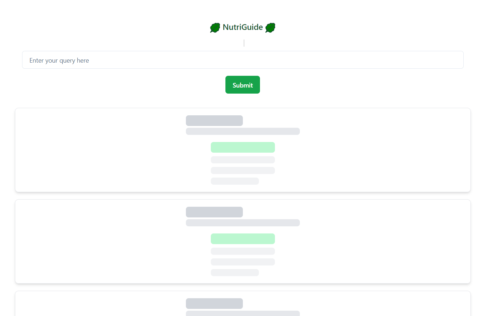
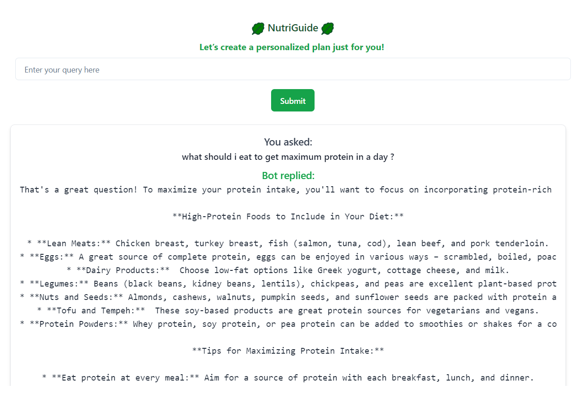

<h1>AI Nutritionist</h1>

AI Nutritionist is a web application that provides users with nutrition-related answers using an AI-powered assistant. Built with the MERN stack and integrated with the Gemini API, it allows users to ask any nutrition-related questions and receive responses based on AI-driven analysis.

<h2>Features</h2>
<ul>
  <li><strong>AI-powered nutrition advice</strong>: Users can ask questions related to nutrition and get answers based on the Gemini API.</li>
  <li><strong>Responsive user interface</strong>: A clean and intuitive user interface that works across all devices.</li>
  <li><strong>No Authentication</strong>: No login or sign-up is required; the AI is accessible to everyone.</li>
</ul>

<h2>Technologies Used</h2>
<ul>
  <li><strong>Frontend</strong>: React.js</li>
  <li><strong>Backend</strong>: Node.js, Express.js</li>
  <li><strong>Database</strong>: MongoDB</li>
  <li><strong>API</strong>: Gemini API for AI-based responses</li>
</ul>

<h2>User interface :</h2>

<h2>Prerequisites</h2>

To run this project locally, you need to have the following installed:

<ul>
  <li>Node.js</li>
  <li>MongoDB (local or cloud-based)</li>
  <li>A Gemini API key</li>
</ul>

<h2>Installation</h2>
<ol>
  <li>Clone the repository:
    <pre><code>git clone https://github.com/your-username/ai-nutritionist.git
cd ai-nutritionist</code></pre>
  </li>
  <li>Install dependencies for both client and server:
    <pre><code>cd client
npm install
cd ../server
npm install</code></pre>
  </li>
  <li>Set up environment variables:
    
Create a <code>.env</code> file in the <code>server</code> directory with the following:

    <pre><code>PORT=5000
MONGO_URI=your-mongodb-connection-string
GEMINI_API_KEY=your-gemini-api-key</code></pre>
  </li>
  <li>Start the application:
    <ul>
      <li>Start the server:
        <pre><code>cd server
npm start</code></pre>
      </li>
      <li>Start the client:
        <pre><code>cd client
npm start</code></pre>
      </li>
    </ul>
  </li>
  <li>Open the app in your browser at <code>http://localhost:3000</code>.</li>
</ol>

<h2>API Routes</h2>
<ul>
  <li><code>POST /api/nutrition/ask</code>: Send a nutrition-related question to the AI assistant and get a response.</li>
</ul>

<h2>Project Structure</h2>
<pre><code>ai-nutritionist/
│
├── client/               # React frontend
│   ├── src/
│   └── public/
│
└── server/               # Node.js backend
    ├── routes/           # API routes
    ├── controllers/      # Controller functions
    ├── models/           # MongoDB models
    └── config/           # Configuration (MongoDB, environment variables)
</code></pre>

<h2>Usage</h2>
<ol>
  <li>Type in a nutrition-related question.</li>
  <li>Submit the question to receive a response from the AI Nutritionist.</li>
  <li>The response will be displayed instantly.</li>
</ol>

<h2>Future Enhancements</h2>
<ul>
  <li>Add user authentication to track user queries.</li>
  <li>Improve the AI model to provide more personalized nutrition advice.</li>
  <li>Add history of queries for users.</li>
</ul>

<h2>License</h2>

This project is licensed under the MIT License. See the <code>LICENSE</code> file for details.
